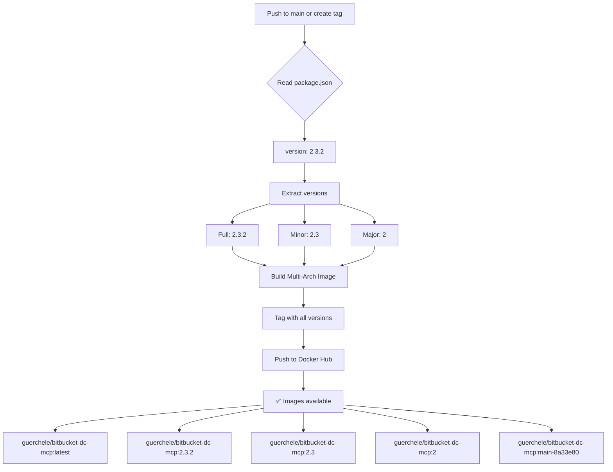

# Docker Versioning Guide

This guide explains how to tag and publish Docker images with proper semantic versioning based on your `package.json` version.

## 🎯 TL;DR - GitHub Actions Works Automatically!

**Yes, GitHub Actions will automatically version your Docker images!** 

Just push to `main` or create a Git tag:
```bash
git push origin main           # → Tags: latest, 2.3.2, 2.3, 2, main-abc123
# OR
git tag v2.3.2 && git push origin v2.3.2  # → Same tags
```

**No manual work needed!** The workflow reads `package.json` and creates all version tags automatically.

---

## Quick Start

### Option 1: Automated Script (Recommended)

```bash
# Build the image
npm run docker:build

# Tag and push with version from package.json
npm run docker:tag
```

This will automatically:
- Read version from `package.json` (currently `2.3.2`)
- Tag as: `2.3.2`, `2.3`, `2`, and `latest`
- Push all tags to Docker Hub

### Option 2: Manual Commands

```bash
# Get version from package.json
VERSION=$(node -p "require('./package.json').version")

# Build with multiple tags
docker build \
  -t guerchele/bitbucket-dc-mcp:latest \
  -t guerchele/bitbucket-dc-mcp:$VERSION \
  -t guerchele/bitbucket-dc-mcp:$(echo $VERSION | cut -d. -f1,2) \
  -t guerchele/bitbucket-dc-mcp:$(echo $VERSION | cut -d. -f1) \
  .

# Push all tags
docker push guerchele/bitbucket-dc-mcp --all-tags
```

### Option 3: GitHub Actions (Automated CI/CD) ✅

GitHub Actions automatically builds and tags your images in these scenarios:

#### **Scenario A: Push to `main` branch**
```bash
git push origin main
```

**Tags created automatically:**
- ✅ `latest` - Always points to latest main
- ✅ `2.3.2` - From package.json version
- ✅ `2.3` - Major.minor from package.json
- ✅ `2` - Major from package.json
- ✅ `main-8a33e80` - Branch + commit SHA

#### **Scenario B: Create a Git tag**
```bash
git tag v2.3.2
git push origin v2.3.2
```

**Tags created automatically:**
- ✅ `2.3.2` - From Git tag (takes precedence)
- ✅ `2.3` - Major.minor from Git tag
- ✅ `2` - Major from Git tag
- ✅ `latest` - If on main branch
- ✅ `main-8a33e80` - Branch + commit SHA

#### **Scenario C: Pull Request**
```bash
git checkout -b feature/new-feature
git push origin feature/new-feature
# Create PR on GitHub
```

**Tags created (not pushed):**
- ✅ `pr-123` - PR number (build only, not pushed)

**What happens:** Builds image for testing but doesn't push to Docker Hub

## Tagging Strategy

Your Docker images follow this semantic versioning pattern:

| Tag | Example | Purpose |
|-----|---------|---------|
| `latest` | `latest` | Always points to the latest stable release from `main` |
| Full version | `2.3.2` | Specific version, pin for reproducibility |
| Major.Minor | `2.3` | Latest patch in the 2.3.x series |
| Major | `2` | Latest minor/patch in the 2.x.x series |
| Branch + SHA | `main-8a33e80` | Specific commit, useful for testing |

## Workflow Examples

### Publishing a New Version

1. **Update version in package.json:**
   ```bash
   npm version patch  # 2.3.2 -> 2.3.3
   # or
   npm version minor  # 2.3.2 -> 2.4.0
   # or
   npm version major  # 2.3.2 -> 3.0.0
   ```

2. **Build and push:**
   ```bash
   npm run docker:build
   npm run docker:tag
   ```

3. **Commit and tag:**
   ```bash
   git add package.json package-lock.json
   git commit -m "chore: bump version to $(node -p 'require(\"./package.json\").version')"
   git tag v$(node -p 'require("./package.json").version')
   git push origin main --tags
   ```

### Testing a Development Build

```bash
# Build with a test tag
docker build -t guerchele/bitbucket-dc-mcp:test-feature .

# Test locally
docker run -it guerchele/bitbucket-dc-mcp:test-feature

# Push to Docker Hub (optional)
docker push guerchele/bitbucket-dc-mcp:test-feature
```

### Pulling Specific Versions

```bash
# Latest stable
docker pull guerchele/bitbucket-dc-mcp:latest

# Specific version (pinned)
docker pull guerchele/bitbucket-dc-mcp:2.3.2

# Latest in 2.3.x series
docker pull guerchele/bitbucket-dc-mcp:2.3

# Latest in 2.x.x series
docker pull guerchele/bitbucket-dc-mcp:2
```

## Best Practices

### 1. Always Update package.json First
- The version in `package.json` is the single source of truth
- Use `npm version` to update it (handles Git tags automatically)

### 2. Use Semantic Versioning
- **Patch** (2.3.2 → 2.3.3): Bug fixes, no breaking changes
- **Minor** (2.3.2 → 2.4.0): New features, backward compatible
- **Major** (2.3.2 → 3.0.0): Breaking changes

### 3. Pin Versions in Production
- Use specific versions: `guerchele/bitbucket-dc-mcp:2.3.2`
- Avoid `latest` in production for reproducibility

### 4. Test Before Tagging
```bash
# Build locally
npm run docker:build

# Run integration tests
npm run test:integration

# Then tag and push
npm run docker:tag
```

## How GitHub Actions Versioning Works



**The workflow automatically:**
1. ✅ Reads version from `package.json` (no Git tag required!)
2. ✅ Extracts major, minor, and patch versions
3. ✅ Builds multi-architecture images (AMD64 + ARM64)
4. ✅ Tags with all semantic version variations
5. ✅ Pushes to Docker Hub
6. ✅ Runs security scans and health checks

## GitHub Actions Configuration

The automated workflow (`.github/workflows/docker-build.yml`) provides:

- ✅ Multi-architecture builds (AMD64, ARM64)
- ✅ Automatic version tagging from `package.json`
- ✅ Security scanning with Trivy
- ✅ Image size validation (<200MB)
- ✅ Health check testing
- ✅ Caching for faster builds

### Required Secrets

Set these in your GitHub repository settings:

- `DOCKER_USERNAME`: Your Docker Hub username
- `DOCKER_PASSWORD`: Docker Hub access token (not password!)

### Verifying It Works

After pushing to `main`, check:

1. **GitHub Actions tab** - View workflow run logs
   ```
   https://github.com/guercheLE/bitbucket-dc-mcp/actions
   ```

2. **Look for "Extract metadata" step output:**
   ```
   📦 Package version: 2.3.2 (major: 2, minor: 2.3)
   tags: docker.io/guerchele/bitbucket-dc-mcp:latest
         docker.io/guerchele/bitbucket-dc-mcp:2.3.2
         docker.io/guerchele/bitbucket-dc-mcp:2.3
         docker.io/guerchele/bitbucket-dc-mcp:2
         docker.io/guerchele/bitbucket-dc-mcp:main-8a33e80
   ```

3. **Check Docker Hub:**
   ```
   https://hub.docker.com/r/guerchele/bitbucket-dc-mcp/tags
   ```

4. **Test pulling the versioned image:**
   ```bash
   docker pull guerchele/bitbucket-dc-mcp:2.3.2
   docker pull guerchele/bitbucket-dc-mcp:2.3
   docker pull guerchele/bitbucket-dc-mcp:2
   ```

## Troubleshooting

### Local Issues

#### "Image not found" when running script
```bash
# Build the image first
npm run docker:build
```

#### "Not logged in to Docker Hub"
```bash
docker login
# Enter your Docker Hub credentials
```

#### Version mismatch
```bash
# Check current version
node -p "require('./package.json').version"

# Update if needed
npm version patch
```

#### Push fails with permission denied
- Ensure you're logged in: `docker login`
- Check Docker Hub username matches: `echo $DOCKER_USERNAME`
- Verify you have push access to the repository

### GitHub Actions Issues

#### Workflow fails with "unauthorized: incorrect username or password"
**Solution:** Check your repository secrets:
```
Settings → Secrets and variables → Actions → Repository secrets
```
Ensure you have:
- `DOCKER_USERNAME`: Your Docker Hub username
- `DOCKER_PASSWORD`: Docker Hub **access token** (not your password!)

To create an access token:
1. Go to [Docker Hub](https://hub.docker.com)
2. Account Settings → Security → New Access Token
3. Copy the token and add it to GitHub secrets

#### Workflow completes but images don't appear on Docker Hub
**Possible causes:**
1. **Check the workflow logs** - Look for "Build and push Docker image" step
2. **Verify repository name** - Must match your Docker Hub repo: `guerchele/bitbucket-dc-mcp`
3. **Check if it's a PR** - PRs don't push images (by design)

#### Wrong tags are created
**Check these:**
1. **package.json version** - Is it correct?
   ```bash
   cat package.json | grep version
   ```
2. **Git tag format** - Must be `v*.*.*` (e.g., `v2.3.2`)
   ```bash
   git tag -l
   ```
3. **Branch name** - Workflow only pushes from `main` branch

#### How to verify what tags will be created
**Look at the "Extract metadata" step in workflow logs:**
```
Run docker/metadata-action@v5
  images: docker.io/guerchele/bitbucket-dc-mcp
  tags: |
    type=ref,event=pr
    type=ref,event=branch
    ...
  
tags: docker.io/guerchele/bitbucket-dc-mcp:latest
      docker.io/guerchele/bitbucket-dc-mcp:2.3.2
      docker.io/guerchele/bitbucket-dc-mcp:2.3
      docker.io/guerchele/bitbucket-dc-mcp:2
      docker.io/guerchele/bitbucket-dc-mcp:main-8a33e80
```

## Related Documentation

- [Docker Build Documentation](docker.md)
- [GitHub Actions Workflow](.github/workflows/docker-build.yml)
- [Docker Hub Repository](https://hub.docker.com/r/guerchele/bitbucket-dc-mcp)
- [Semantic Versioning Guide](https://semver.org)
