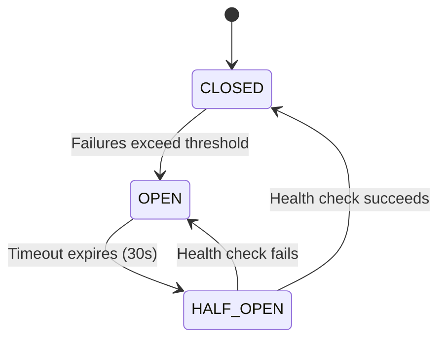

# Backend Architecture

> **Plain Language Summary:**  
> This section dives into the "backend" - the server-side code that does the real work. Think of it as the engine room. We'll cover:
> - **How the server runs** (Node.js process, not cloud functions)
> - **Code organization** (where to put different types of code)
> - **The main entry point** (where the program starts)
> - **How we talk to the database** (Repository pattern)
> - **How we handle authentication** (Strategy pattern with multiple auth methods)

### Service Architecture

#### Traditional Server (Node.js Process)

O MCP Server roda como processo Node.js standalone (não é serverless). Pode ser deployado como:
- Docker container (recomendado)
- npm global package (process gerenciado por PM2/systemd)
- Bare metal (node dist/index.js)

##### Process Organization

```
bitbucket-mcp process
├── Main Thread
│   ├── MCP Protocol Handler (stdio)
│   ├── SemanticSearchService
│   ├── BitbucketClientService
│   ├── AuthManager
│   └── Core utilities (sync operations)
└── No worker threads (single-threaded)
```

**Rationale:** 
- Node.js single-threaded é suficiente (I/O-bound workload, não CPU-intensive)
- Async/await para operações I/O (Bitbucket API calls, DB queries)
- No need for worker threads (embeddings generation é build-time, não runtime)

##### Server Entry Point Template

```typescript
// src/index.ts
import { MCPServer } from './core/mcp-server.js';
import { ConfigManager } from './core/config-manager.js';
import { Logger } from './core/logger.js';

async function main() {
  const logger = Logger.getInstance();
  
  try {
    // Load config from file/env vars
    const config = await ConfigManager.load();
    
    // Initialize MCP server
    const server = new MCPServer(config);
    
    // Register tools (search_ids, get_id, call_id)
    await server.registerTools();
    
    // Start listening on stdio
    await server.start();
    
    logger.info('MCP Server started successfully', {
      version: process.env.npm_package_version,
      bitbucket_url: config.bitbucket_url,
    });
    
    // Graceful shutdown handlers
    process.on('SIGTERM', () => server.shutdown());
    process.on('SIGINT', () => server.shutdown());
    
  } catch (error) {
    logger.error('Failed to start MCP server', { error });
    process.exit(1);
  }
}

main();
```

### Database Architecture

#### Schema Design

Database é read-only em runtime (write apenas durante build-time).

```sql
-- sqlite-vec database (embeddings.db)

-- Operations metadata
CREATE TABLE operations (
    operation_id TEXT PRIMARY KEY,
    path TEXT NOT NULL,
    method TEXT NOT NULL,
    summary TEXT NOT NULL,
    description TEXT,
    tags TEXT, -- JSON: ["Issues", "Projects"]
    parameters TEXT, -- JSON array
    request_body TEXT, -- JSON schema
    responses TEXT, -- JSON responses by status code
    deprecated INTEGER DEFAULT 0
);

-- Embeddings (virtual table, sqlite-vec)
CREATE VIRTUAL TABLE embeddings USING vec0(
    operation_id TEXT PRIMARY KEY,
    vector FLOAT[1536]
);

-- Indexes
CREATE INDEX idx_operations_method ON operations(method);
CREATE INDEX idx_operations_deprecated ON operations(deprecated) WHERE deprecated = 0;
```

#### Data Access Layer

```typescript
// src/data/embeddings-repository.ts
import Database from 'better-sqlite3';

export class EmbeddingsRepository {
  private db: Database.Database;
  
  constructor(dbPath: string) {
    this.db = new Database(dbPath, { readonly: true });
    this.db.loadExtension('vec0'); // sqlite-vec extension
  }
  
  /**
   * Cosine similarity search
   * Returns top K most similar operations
   */
  search(queryVector: Float32Array, limit: number = 5): SearchResult[] {
    const stmt = this.db.prepare(`
      SELECT 
        e.operation_id,
        o.summary,
        o.description,
        vec_distance_cosine(e.vector, ?) as distance
      FROM embeddings e
      JOIN operations o ON e.operation_id = o.operation_id
      WHERE o.deprecated = 0
      ORDER BY distance ASC
      LIMIT ?
    `);
    
    const results = stmt.all(Buffer.from(queryVector.buffer), limit);
    
    return results.map(row => ({
      operation_id: row.operation_id,
      summary: row.summary,
      similarity_score: 1 - row.distance, // Convert distance to similarity
    }));
  }
  
  /**
   * Get operation metadata by ID
   */
  getOperation(operationId: string): Operation | null {
    const stmt = this.db.prepare(`
      SELECT * FROM operations WHERE operation_id = ?
    `);
    
    const row = stmt.get(operationId);
    if (!row) return null;
    
    return {
      operation_id: row.operation_id,
      path: row.path,
      method: row.method,
      summary: row.summary,
      description: row.description,
      tags: JSON.parse(row.tags),
      parameters: JSON.parse(row.parameters),
      requestBody: row.request_body ? JSON.parse(row.request_body) : null,
      responses: JSON.parse(row.responses),
    };
  }
  
  close() {
    this.db.close();
  }
}
```

### Authentication and Authorization

#### Auth Flow (OAuth 2.0 PKCE)

```mermaid
sequenceDiagram
    participant USER as User
    participant CLI as Setup CLI
    participant AUTH as AuthManager
    participant HTTP as Local HTTP Server<br/>(port 8080)
    participant BROWSER as Browser
    participant BITBUCKET as Bitbucket DC<br/>OAuth Endpoint
    participant KEYCHAIN as OS Keychain

    USER->>CLI: bitbucket-mcp setup
    CLI->>AUTH: initOAuth2Flow(config)
    AUTH->>AUTH: Generate PKCE params<br/>code_verifier, code_challenge
    AUTH->>HTTP: Start local server :8080/callback
    AUTH->>BROWSER: Open authorization URL<br/>+ code_challenge + state
    
    BROWSER->>BITBUCKET: GET /oauth/authorize<br/>?client_id=X&redirect_uri=...
    BITBUCKET-->>BROWSER: Login form
    USER->>BROWSER: Enter credentials, approve
    BROWSER->>BITBUCKET: POST /oauth/authorize (approval)
    BITBUCKET-->>BROWSER: 302 Redirect<br/>http://localhost:8080/callback?code=AUTH_CODE&state=STATE
    
    BROWSER->>HTTP: GET /callback?code=AUTH_CODE
    HTTP->>AUTH: Callback received (code, state)
    AUTH->>AUTH: Validate state (CSRF protection)
    AUTH->>BITBUCKET: POST /oauth/token<br/>code + code_verifier
    BITBUCKET-->>AUTH: {access_token, refresh_token, expires_in}
    
    AUTH->>KEYCHAIN: save(bitbucket_url, credentials)
    KEYCHAIN-->>AUTH: Stored successfully
    
    AUTH->>BITBUCKET: Test: GET /rest/api/latest/admin/users<br/>Authorization: Bearer {token}
    BITBUCKET-->>AUTH: {id, name, displayName}
    
    AUTH-->>CLI: Success + user info
    HTTP->>HTTP: Shutdown local server
    CLI-->>USER: ✓ Connected as {displayName}
```



#### Auth Middleware/Guards

```typescript
// src/auth/auth-manager.ts
import { AuthStrategy } from './auth-strategy.js';
import { OAuth2Strategy } from './strategies/oauth2-strategy.js';
import { PATStrategy } from './strategies/pat-strategy.js';
import { CredentialStorage } from '../core/credential-storage.js';

export class AuthManager {
  private strategy: AuthStrategy;
  private storage: CredentialStorage;
  
  constructor(config: Config, storage: CredentialStorage) {
    this.storage = storage;
    this.strategy = this.selectStrategy(config);
  }
  
  private selectStrategy(config: Config): AuthStrategy {
    switch (config.auth_method) {
      case 'oauth2':
        return new OAuth2Strategy(config);
      case 'pat':
        return new PATStrategy(config);
      case 'oauth1':
        return new OAuth1Strategy(config);
      case 'basic':
        return new BasicAuthStrategy(config);
      default:
        throw new Error(`Unsupported auth method: ${config.auth_method}`);
    }
  }
  
  /**
   * Get valid auth headers for Bitbucket API request
   * Handles token refresh if needed
   */
  async getAuthHeaders(): Promise<Headers> {
    let credentials = await this.storage.load(this.config.bitbucket_url);
    
    // Check if token expired
    if (credentials?.expires_at && new Date() >= credentials.expires_at) {
      logger.info('Access token expired, refreshing...');
      credentials = await this.strategy.refreshToken(credentials);
      await this.storage.save(this.config.bitbucket_url, credentials);
    }
    
    return this.strategy.getAuthHeaders(credentials);
  }
  
  /**
   * Validate credentials by calling Bitbucket /myself endpoint
   */
  async validateCredentials(): Promise<boolean> {
    try {
      const headers = await this.getAuthHeaders();
      const response = await fetch(
        `${this.config.bitbucket_url}/rest/api/latest/projects`,
        { headers }
      );
      return response.ok;
    } catch {
      return false;
    }
  }
}
```

```typescript
// src/auth/strategies/oauth2-strategy.ts
export class OAuth2Strategy implements AuthStrategy {
  async authenticate(config: Config): Promise<Credentials> {
    // Generate PKCE parameters
    const codeVerifier = generateRandomString(128);
    const codeChallenge = await sha256(codeVerifier);
    
    // Start local HTTP server for callback
    const server = await this.startCallbackServer();
    
    // Open browser to authorization URL
    const authUrl = new URL(`${config.bitbucket_url}/oauth/authorize`);
    authUrl.searchParams.set('client_id', config.client_id);
    authUrl.searchParams.set('redirect_uri', 'http://localhost:8080/callback');
    authUrl.searchParams.set('response_type', 'code');
    authUrl.searchParams.set('scope', 'read write');
    authUrl.searchParams.set('code_challenge', codeChallenge);
    authUrl.searchParams.set('code_challenge_method', 'S256');
    authUrl.searchParams.set('state', generateRandomString(32));
    
    open(authUrl.toString());
    
    // Wait for callback (with 5min timeout)
    const { code, state } = await server.waitForCallback(300000);
    
    // Exchange code for tokens
    const tokenResponse = await fetch(`${config.bitbucket_url}/oauth/token`, {
      method: 'POST',
      headers: { 'Content-Type': 'application/x-www-form-urlencoded' },
      body: new URLSearchParams({
        grant_type: 'authorization_code',
        code,
        code_verifier: codeVerifier,
        client_id: config.client_id,
        client_secret: config.client_secret,
        redirect_uri: 'http://localhost:8080/callback',
      }),
    });
    
    const tokens = await tokenResponse.json();
    
    return {
      bitbucket_url: config.bitbucket_url,
      auth_method: 'oauth2',
      access_token: tokens.access_token,
      refresh_token: tokens.refresh_token,
      expires_at: new Date(Date.now() + tokens.expires_in * 1000),
    };
  }
  
  async refreshToken(credentials: Credentials): Promise<Credentials> {
    const response = await fetch(`${credentials.bitbucket_url}/oauth/token`, {
      method: 'POST',
      headers: { 'Content-Type': 'application/x-www-form-urlencoded' },
      body: new URLSearchParams({
        grant_type: 'refresh_token',
        refresh_token: credentials.refresh_token!,
        client_id: this.config.client_id,
        client_secret: this.config.client_secret,
      }),
    });
    
    const tokens = await response.json();
    
    return {
      ...credentials,
      access_token: tokens.access_token,
      refresh_token: tokens.refresh_token || credentials.refresh_token,
      expires_at: new Date(Date.now() + tokens.expires_in * 1000),
    };
  }
}
```

#### OAuth 2.0 PKCE Implementation Validation Checklist

**🔒 Security-Critical Implementation - Follow This Checklist**

When implementing OAuth 2.0 with PKCE, validate these 10 security requirements:

**Phase 1: PKCE Parameter Generation ✅**
- [ ] **code_verifier** is random 128-character string (high entropy)
- [ ] **code_challenge** = SHA256(code_verifier) + base64url encode
- [ ] **code_challenge_method** = 'S256' (not 'plain')
- [ ] **state** parameter is random UUID (CSRF protection)
- [ ] Store `code_verifier` and `state` securely until callback

**Phase 2: Authorization Request ✅**
- [ ] Authorization URL includes all required params: `client_id`, `redirect_uri`, `response_type=code`, `code_challenge`, `code_challenge_method`, `state`, `scope`
- [ ] `redirect_uri` exactly matches what's registered in Bitbucket OAuth app
- [ ] `scope` includes minimum permissions needed (e.g., "read write")
- [ ] Timeout set on callback server (5 minutes maximum)
- [ ] User is informed: "Opening browser for Bitbucket authorization..."

**Phase 3: Callback Handling ✅**
- [ ] **Validate `state` parameter** matches stored value (CRITICAL: prevents CSRF)
- [ ] Extract `code` from callback URL query params
- [ ] Close callback server immediately after receiving code
- [ ] Timeout if no callback within 5 minutes (user may have cancelled)
- [ ] Handle error params: `error`, `error_description` in callback

**Phase 4: Token Exchange ✅**
- [ ] POST to `/oauth/token` includes: `grant_type=authorization_code`, `code`, `code_verifier`, `client_id`, `client_secret`, `redirect_uri`
- [ ] **code_verifier** matches original generated value (CRITICAL: PKCE validation)
- [ ] Handle token response errors: 400 (invalid_grant), 401 (invalid_client)
- [ ] Store tokens securely: `access_token`, `refresh_token`, `expires_in` → OS Keychain
- [ ] Calculate `expires_at` = now + expires_in (with 5-minute buffer for refresh)

**Phase 5: Token Refresh ✅**
- [ ] Check `expires_at` before each API call (with 5-minute buffer)
- [ ] POST to `/oauth/token` with: `grant_type=refresh_token`, `refresh_token`, `client_id`, `client_secret`
- [ ] Update stored tokens with new values (access_token may change, refresh_token may rotate)
- [ ] Handle refresh errors: 401 → re-authenticate user (refresh token expired/revoked)
- [ ] Log refresh events for observability (not the tokens themselves!)

**Phase 6: Security Validation ✅**
- [ ] **NEVER log tokens** (access_token, refresh_token, code_verifier, client_secret)
- [ ] Use HTTPS for all Bitbucket OAuth endpoints (reject HTTP)
- [ ] Validate `redirect_uri` is http://localhost (or registered HTTPS domain)
- [ ] Clear `code_verifier` and `state` from memory after use (one-time parameters)
- [ ] Implement token rotation if Bitbucket returns new `refresh_token`

**⚠️ Common OAuth2 Security Pitfalls:**
- ❌ Not validating `state` parameter (CSRF vulnerability)
- ❌ Reusing `code_verifier` across flows (PKCE violation)
- ❌ Logging tokens in error messages (credential exposure)
- ❌ Not checking `expires_at` before requests (401 errors under load)
- ❌ Using `code_challenge_method=plain` (defeats PKCE purpose)

**✅ Reference Implementation:** See `src/auth/strategies/oauth2-strategy.ts` above (65 lines)

---

```typescript
// REMOVED DUPLICATE
  
  getAuthHeaders(credentials: Credentials): Headers {
    return new Headers({
      'Authorization': `Bearer ${credentials.access_token}`,
    });
  }
}
```


## Circuit Breaker Pattern

### Overview

The server implements the **Circuit Breaker pattern** to protect against cascading failures when Bitbucket Data Center is experiencing issues. This prevents overwhelming a struggling Bitbucket instance and enables graceful degradation.

### State Machine



**State Behaviors:**

- **CLOSED** (Normal operation)
  - All requests pass through to Bitbucket
  - Track success/failure rates
  - Monitor for threshold breaches

- **OPEN** (Fail-fast mode)
  - Reject requests immediately without calling Bitbucket
  - Return `CircuitBreakerError` with clear message
  - Wait for timeout period (default 30s)
  - Protects Bitbucket from additional load

- **HALF_OPEN** (Testing recovery)
  - Allow single test request to check if Bitbucket recovered
  - Success → transition to CLOSED (normal operation restored)
  - Failure → transition back to OPEN (Bitbucket still down)

### Threshold Configuration

Circuit opens when **either** threshold is exceeded:

1. **Consecutive Failures**: 5 failures in a row (default)
2. **Failure Rate**: >50% failures in 10-second rolling window (requires minimum 10 requests)

**Environment Variables:**

```bash
CIRCUIT_BREAKER_FAILURE_THRESHOLD=5      # Consecutive failures
CIRCUIT_BREAKER_FAILURE_RATE=0.5         # 0.5 = 50% failure rate
CIRCUIT_BREAKER_WINDOW_SIZE=10000        # 10 seconds in milliseconds
CIRCUIT_BREAKER_TIMEOUT=30000            # 30 seconds before retry
CIRCUIT_BREAKER_MINIMUM_REQUESTS=10      # Min requests for rate calculation
```

### Integration with BitbucketClientService

Circuit breaker wraps all Bitbucket API operations:

```typescript
// src/services/bitbucket-client.ts
export class BitbucketClientService {
  private readonly circuitBreaker: CircuitBreaker;

  async executeOperation(operationId: string, params: unknown): Promise<unknown> {
    // All operations protected by circuit breaker
    return await this.circuitBreaker.execute(async () => {
      // Existing retry logic and HTTP calls
      return await this.executeWithRetry(...);
    });
  }
}
```

Default circuit breaker created automatically if not provided in constructor.

### Logging & Observability

**Log Events:**

- `warn`: State transitions with reason and metrics
- `info`: Rejected requests (OPEN state), health check attempts
- `debug`: Request execution in CLOSED state

**Example Logs:**

```json
{
  "level": "warn",
  "msg": "Circuit breaker state changed",
  "from": "CLOSED",
  "to": "OPEN",
  "reason": "consecutive failure threshold exceeded (5/5)",
  "metrics": {
    "totalRequests": 127,
    "totalFailures": 5,
    "consecutiveFailures": 5
  }
}
```

**Metrics Export:**

```typescript
const metrics = bitbucketClient.getCircuitBreakerMetrics();
// Returns: { state, failure_count, success_count, last_state_change, uptime_ms }
```

### Tuning Guidance

**For High-Traffic Environments:**
- Increase `CIRCUIT_BREAKER_MINIMUM_REQUESTS` to 20-50 (more data for rate calculation)
- Decrease `CIRCUIT_BREAKER_WINDOW_SIZE` to 5000ms (faster reaction to issues)

**For Unstable Bitbucket Instances:**
- Increase `CIRCUIT_BREAKER_TIMEOUT` to 60000ms (give more recovery time)
- Decrease `CIRCUIT_BREAKER_FAILURE_THRESHOLD` to 3 (open circuit faster)

**For Testing/Development:**
- Increase thresholds to prevent false positives
- Set `LOG_LEVEL=debug` to see all circuit breaker decisions

### Troubleshooting

**Circuit Frequently Opening:**

1. Check Bitbucket Data Center health:
   - High CPU/memory on Bitbucket nodes
   - Database connection pool exhausted
   - Network latency spikes

2. Review circuit breaker logs:
   - Look for consecutive vs. rate-based triggers
   - Check `metrics.lastError` for root cause

3. Adjust thresholds if needed:
   - Temporary network blips → increase `FAILURE_THRESHOLD`
   - Sustained outages → current settings appropriate

**Circuit Not Opening When Expected:**

- Verify failures are actually reaching circuit breaker (check total failure count)
- Ensure errors are being thrown (not caught and swallowed)
- Check if retry logic succeeds before circuit breaker sees failure

**Performance Impact:**

- Circuit breaker adds <1ms overhead in CLOSED state
- Memory usage: ~1KB per 100 requests in rolling window
- No background threads or timers (event-driven state changes)

### Implementation Details

**File**: `src/core/circuit-breaker.ts`

**Key Components:**

- `CircuitBreaker` class: Main implementation with state machine
- `CircuitBreakerError` class: Thrown when circuit is OPEN
- `CircuitBreakerMetrics` interface: Monitoring data structure

**Memory Management:**

- Uses circular buffer for request history (bounded memory)
- Automatic cleanup of old entries outside time window
- No memory leaks from unbounded request tracking

**Thread Safety:**

- Single-threaded Node.js execution model
- No explicit locking needed
- State transitions are synchronous and atomic

