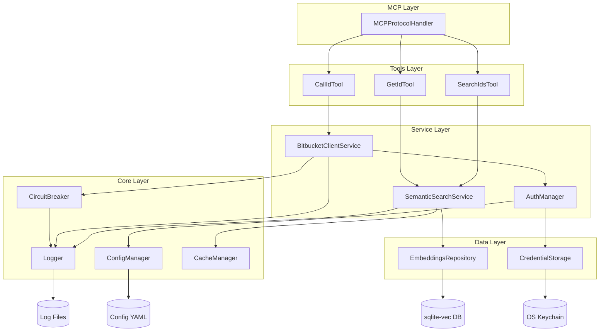

# Components

> **Plain Language Summary:**  
> This section breaks down the major "building blocks" of the system. Each component is like a specialized worker with a specific job. We'll describe:
> - **What each component does** (Responsibilities)
> - **How components talk to each other** (Interfaces)
> - **What each component needs** (Dependencies)
> - **A visual diagram** showing how they connect

### MCP Protocol Handler

**Responsibility:** Gerencia comunicação stdio com LLM clients, implementa handshake MCP, routing de tool calls.

**Key Interfaces:**
- `initialize()` → Server info & capabilities
- `tools/list` → Lista de 3 tools disponíveis
- `tools/call` → Executa tool (search_ids, get_id, call_id)

**Dependencies:** Logger, ErrorHandler

**Technology Stack:** @modelcontextprotocol/sdk, stdio transport

---

### Semantic Search Service

**Responsibility:** Busca semântica de operations usando embeddings e cosine similarity.

**Key Interfaces:**
- `search(query: string, limit: number): Promise<SearchResult[]>`
- `generateQueryEmbedding(query: string): Promise<Float32Array>`

**Dependencies:**
- EmbeddingsRepository (sqlite-vec queries)
- @xenova/transformers (local embeddings via Xenova/all-mpnet-base-v2)
- CacheManager (LRU cache para frequent queries)

**Technology Stack:** sqlite-vec, @xenova/transformers, better-sqlite3

---

### Bitbucket Client Service

**Responsibility:** HTTP calls para Bitbucket DC REST API com resilience (rate limiting, retries, circuit breaker).

**Key Interfaces:**
- `executeOperation(operationId: string, params: any): Promise<any>`
- `get/post/put/delete(path: string, options: RequestOptions): Promise<Response>`

**Dependencies:**
- AuthManager (adiciona auth headers)
- CircuitBreaker (fail-fast protection)
- RateLimiter (token bucket algorithm)
- Logger (request/response logging)

**Technology Stack:** node-fetch, circuit breaker pattern

---

### Auth Manager

**Responsibility:** Gerencia autenticação multi-estratégia, token refresh, credential storage.

**Key Interfaces:**
- `authenticate(config: Config): Promise<Credentials>`
- `getAuthHeaders(): Promise<Headers>`
- `refreshToken(credentials: Credentials): Promise<Credentials>`

**Dependencies:**
- AuthStrategy implementations (OAuth2, PAT, OAuth1, Basic)
- CredentialStorage (OS keychain)
- Logger

**Technology Stack:** Strategy pattern, node-keytar

---

### Config Manager

**Responsibility:** Carrega e valida configuração de múltiplas sources (file, env vars, defaults).

**Key Interfaces:**
- `load(): Promise<Config>`
- `validate(config: Partial<Config>): Config`
- `get<K extends keyof Config>(key: K): Config[K]`

**Dependencies:** Zod (schema validation), fs (file reading)

**Technology Stack:** Zod, YAML parser (js-yaml)

---

### Logger

**Responsibility:** Structured logging com correlation IDs, log rotation, sensitive data redaction.

**Key Interfaces:**
- `debug/info/warn/error(message: string, context?: object)`
- `child(bindings: object): Logger`

**Dependencies:** pino, pino-rotating-file

**Technology Stack:** pino (JSON structured logs)

---

### Circuit Breaker

**Responsibility:** Fail-fast protection quando Bitbucket DC está down, evita cascading failures.

**Key States:** CLOSED (normal) → OPEN (failing) → HALF_OPEN (testing recovery)

**Key Interfaces:**
- `execute<T>(fn: () => Promise<T>): Promise<T>`
- `getState(): CircuitBreakerState`
- `reset(): void`

**Dependencies:** Logger (state transitions)

**Technology Stack:** Custom implementation, state machine

---

### Embeddings Repository

**Responsibility:** Abstração para queries de vector search no sqlite-vec.

**Key Interfaces:**
- `search(vector: Float32Array, limit: number): Promise<SearchResult[]>`
- `insert(operationId: string, vector: Float32Array): Promise<void>`

**Dependencies:** better-sqlite3 (sqlite-vec extension)

**Technology Stack:** sqlite-vec, SQL queries

### Component Diagram

