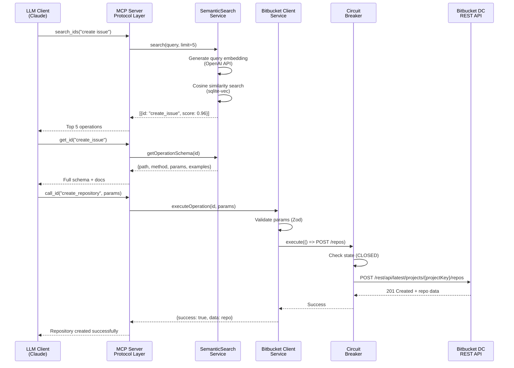
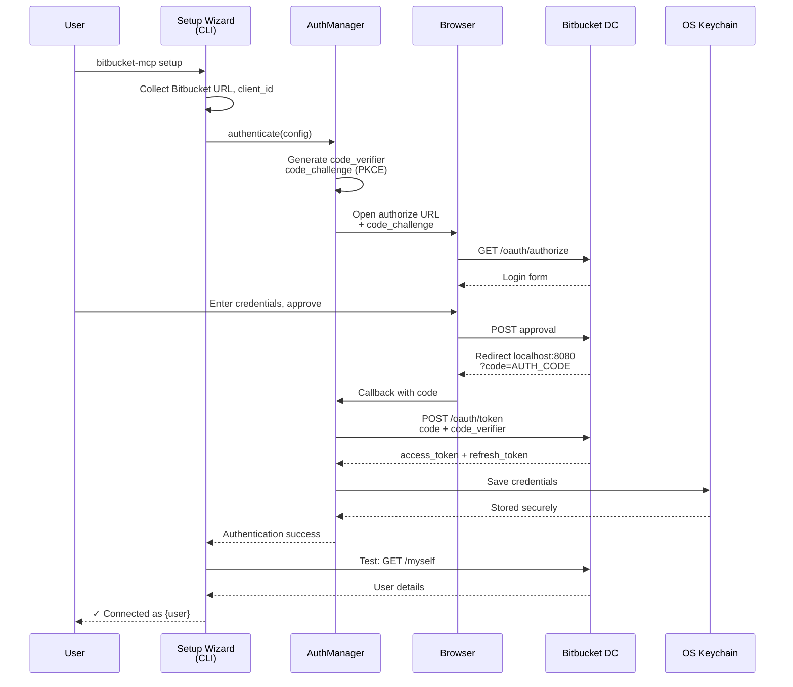
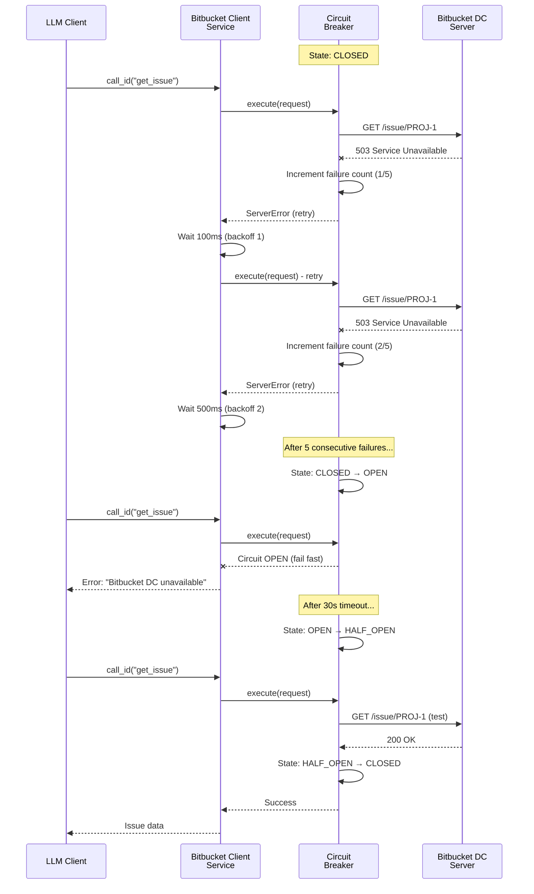

# Core Workflows

### Workflow 1: Semantic Search → Get Schema → Execute Operation

```mermaid
sequenceDiagram
    participant LLM as LLM Client<br/>(Claude)
    participant MCP as MCP Server<br/>Protocol Layer
    participant SEARCH as SemanticSearch<br/>Service
    participant BITBUCKET as Bitbucket Client<br/>Service
    participant CB as Circuit<br/>Breaker
    participant BITBUCKETSRV as Bitbucket DC<br/>REST API

    LLM->>MCP: search_ids("create issue")
    MCP->>SEARCH: search(query, limit=5)
    SEARCH->>SEARCH: Generate query embedding<br/>(OpenAI API)
    SEARCH->>SEARCH: Cosine similarity search<br/>(sqlite-vec)
    SEARCH-->>MCP: [{id: "create_issue", score: 0.96}]
    MCP-->>LLM: Top 5 operations

    LLM->>MCP: get_id("create_issue")
    MCP->>SEARCH: getOperationSchema(id)
    SEARCH-->>MCP: {path, method, params, examples}
    MCP-->>LLM: Full schema + docs

    LLM->>MCP: call_id("create_repository", params)
    MCP->>BITBUCKET: executeOperation(id, params)
    BITBUCKET->>BITBUCKET: Validate params (Zod)
    BITBUCKET->>CB: execute(() => POST /repos)
    CB->>CB: Check state (CLOSED)
    CB->>BITBUCKETSRV: POST /rest/api/latest/projects/{projectKey}/repos
    BITBUCKETSRV-->>CB: 201 Created + repo data
    CB-->>BITBUCKET: Success
    BITBUCKET-->>MCP: {success: true, data: repo}
    MCP-->>LLM: Repository created successfully
```

### Workflow 2: Authentication Flow (OAuth 2.0 PKCE)

```mermaid
sequenceDiagram
    participant USER as User
    participant WIZARD as Setup Wizard<br/>(CLI)
    participant AUTH as AuthManager
    participant BROWSER as Browser
    participant BITBUCKET as Bitbucket DC
    participant KEYCHAIN as OS Keychain

    USER->>WIZARD: bitbucket-mcp setup
    WIZARD->>WIZARD: Collect Bitbucket URL, client_id
    WIZARD->>AUTH: authenticate(config)
    AUTH->>AUTH: Generate code_verifier<br/>code_challenge (PKCE)
    AUTH->>BROWSER: Open authorize URL<br/>+ code_challenge
    BROWSER->>BITBUCKET: GET /oauth/authorize
    BITBUCKET-->>BROWSER: Login form
    USER->>BROWSER: Enter credentials, approve
    BROWSER->>BITBUCKET: POST approval
    BITBUCKET-->>BROWSER: Redirect localhost:8080<br/>?code=AUTH_CODE
    BROWSER->>AUTH: Callback with code
    AUTH->>BITBUCKET: POST /oauth/token<br/>code + code_verifier
    BITBUCKET-->>AUTH: access_token + refresh_token
    AUTH->>KEYCHAIN: Save credentials
    KEYCHAIN-->>AUTH: Stored securely
    AUTH-->>WIZARD: Authentication success
    WIZARD->>BITBUCKET: Test: GET /myself
    BITBUCKET-->>WIZARD: User details
    WIZARD-->>USER: ✓ Connected as {user}
```

### Workflow 3: Error Handling & Circuit Breaker

```mermaid
sequenceDiagram
    participant LLM as LLM Client
    participant BITBUCKET as Bitbucket Client<br/>Service
    participant CB as Circuit<br/>Breaker
    participant BITBUCKETSRV as Bitbucket DC<br/>Server

    Note over CB: State: CLOSED

    LLM->>BITBUCKET: call_id("get_issue")
    BITBUCKET->>CB: execute(request)
    CB->>BITBUCKETSRV: GET /issue/PROJ-1
    BITBUCKETSRV--xCB: 503 Service Unavailable
    CB->>CB: Increment failure count (1/5)
    CB-->>BITBUCKET: ServerError (retry)
    BITBUCKET->>BITBUCKET: Wait 100ms (backoff 1)
    BITBUCKET->>CB: execute(request) - retry
    CB->>BITBUCKETSRV: GET /issue/PROJ-1
    BITBUCKETSRV--xCB: 503 Service Unavailable
    CB->>CB: Increment failure count (2/5)
    CB-->>BITBUCKET: ServerError (retry)
    BITBUCKET->>BITBUCKET: Wait 500ms (backoff 2)
    
    Note over CB: After 5 consecutive failures...
    CB->>CB: State: CLOSED → OPEN
    
    LLM->>BITBUCKET: call_id("get_issue")
    BITBUCKET->>CB: execute(request)
    CB--xBITBUCKET: Circuit OPEN (fail fast)
    BITBUCKET-->>LLM: Error: "Bitbucket DC unavailable"

    Note over CB: After 30s timeout...
    CB->>CB: State: OPEN → HALF_OPEN
    
    LLM->>BITBUCKET: call_id("get_issue")
    BITBUCKET->>CB: execute(request)
    CB->>BITBUCKETSRV: GET /issue/PROJ-1 (test)
    BITBUCKETSRV-->>CB: 200 OK
    CB->>CB: State: HALF_OPEN → CLOSED
    CB-->>BITBUCKET: Success
    BITBUCKET-->>LLM: Issue data
```

