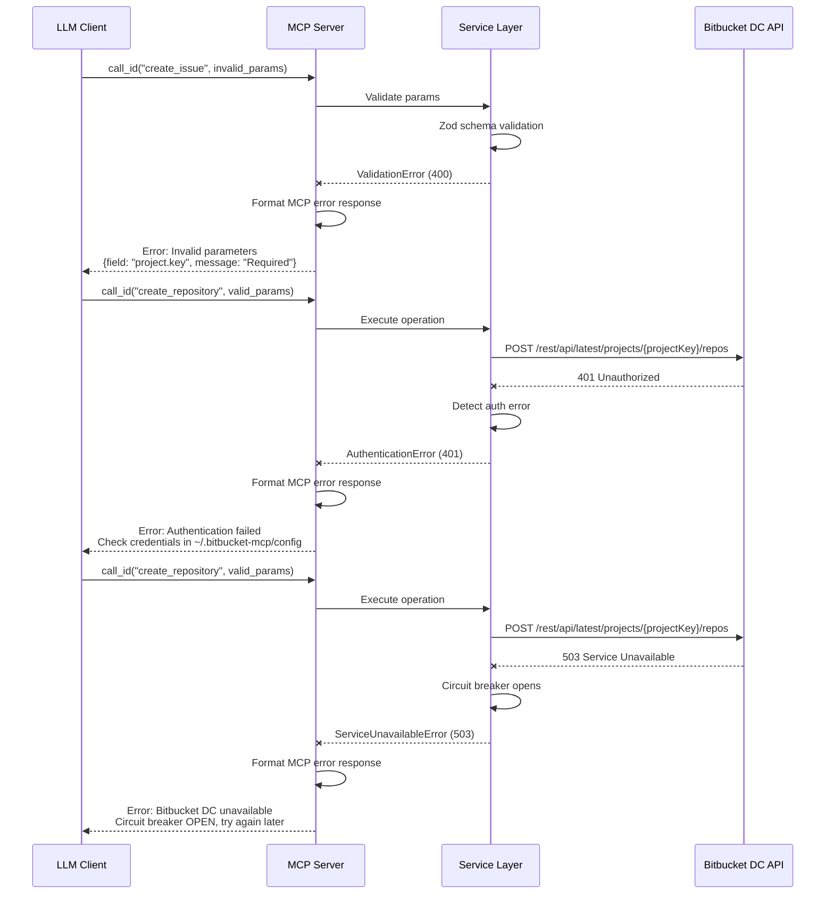

# Error Handling Strategy

### Error Flow



### Error Response Format

```typescript
// src/core/errors.ts
interface ApiError {
  error: {
    code: string;            // Machine-readable error code
    message: string;         // Human-readable message
    details?: Record<string, any>; // Additional context
    timestamp: string;       // ISO-8601 timestamp
    correlation_id: string;  // Request correlation ID
  };
}

// Error Classes Hierarchy
class AppError extends Error {
  constructor(
    public code: string,
    message: string,
    public statusCode: number = 500,
    public details?: Record<string, any>
  ) {
    super(message);
    this.name = this.constructor.name;
  }
}

class ValidationError extends AppError {
  constructor(message: string, details?: Record<string, any>) {
    super('VALIDATION_ERROR', message, 400, details);
  }
}

class AuthenticationError extends AppError {
  constructor(message: string) {
    super('AUTHENTICATION_ERROR', message, 401);
  }
}

class AuthorizationError extends AppError {
  constructor(message: string) {
    super('AUTHORIZATION_ERROR', message, 403);
  }
}

class NotFoundError extends AppError {
  constructor(message: string) {
    super('NOT_FOUND', message, 404);
  }
}

class RateLimitError extends AppError {
  constructor(message: string, retryAfter?: number) {
    super('RATE_LIMIT_EXCEEDED', message, 429, { retry_after: retryAfter });
  }
}

class ServiceUnavailableError extends AppError {
  constructor(message: string) {
    super('SERVICE_UNAVAILABLE', message, 503);
  }
}

class CircuitBreakerOpenError extends AppError {
  constructor(message: string) {
    super('CIRCUIT_BREAKER_OPEN', message, 503);
  }
}
```

### Frontend Error Handling

N/A (produto é backend/CLI apenas)

### Backend Error Handling

```typescript
// src/core/error-handler.ts
import { Logger } from './logger.js';
import { AppError } from './errors.js';

export class ErrorHandler {
  private logger: Logger;
  
  constructor(logger: Logger) {
    this.logger = logger;
  }
  
  /**
   * Handle errors and convert to MCP error response format
   */
  handle(error: Error | AppError, correlationId: string): ApiError {
    // Log error com context
    this.logger.error('Error occurred', {
      correlation_id: correlationId,
      error_name: error.name,
      error_message: error.message,
      stack: error.stack,
      ...(error instanceof AppError && { error_code: error.code }),
    });
    
    // Convert para MCP error format
    if (error instanceof AppError) {
      return {
        error: {
          code: error.code,
          message: error.message,
          details: error.details,
          timestamp: new Date().toISOString(),
          correlation_id: correlationId,
        },
      };
    }
    
    // Unknown errors (should not happen, mas safety net)
    return {
      error: {
        code: 'INTERNAL_ERROR',
        message: 'An unexpected error occurred',
        timestamp: new Date().toISOString(),
        correlation_id: correlationId,
      },
    };
  }
  
  /**
   * Normalize Bitbucket API errors to AppError
   */
  normalizeBitbucketError(response: Response, body: any): AppError {
    switch (response.status) {
      case 400:
        return new ValidationError(
          body.errorMessages?.[0] || 'Invalid request',
          { bitbucket_errors: body.errors }
        );
      case 401:
        return new AuthenticationError(
          'Authentication failed. Check your Bitbucket credentials.'
        );
      case 403:
        return new AuthorizationError(
          'Access denied. Check your Bitbucket permissions.'
        );
      case 404:
        return new NotFoundError(
          body.errorMessages?.[0] || 'Resource not found'
        );
      case 429:
        const retryAfter = parseInt(response.headers.get('Retry-After') || '60');
        return new RateLimitError(
          `Rate limit exceeded. Retry after ${retryAfter}s`,
          retryAfter
        );
      case 503:
        return new ServiceUnavailableError(
          'Bitbucket DC is temporarily unavailable'
        );
      default:
        return new AppError(
          'BITBUCKET_API_ERROR',
          body.errorMessages?.[0] || 'Bitbucket API error',
          response.status
        );
    }
  }
}
```

```typescript
// Example usage em BitbucketClientService
async executeOperation(operationId: string, params: any): Promise<any> {
  const correlationId = generateCorrelationId();
  
  try {
    // Validate params
    const validatedParams = await this.validator.validate(operationId, params);
    
    // Build request
    const { url, options } = this.buildRequest(operationId, validatedParams);
    
    // Execute com circuit breaker
    const response = await this.circuitBreaker.execute(async () => {
      return await fetch(url, options);
    });
    
    // Handle non-ok responses
    if (!response.ok) {
      const body = await response.json();
      throw this.errorHandler.normalizeBitbucketError(response, body);
    }
    
    return await response.json();
    
  } catch (error) {
    // Log e rethrow (MCP layer will convert to error response)
    this.logger.error('Operation execution failed', {
      correlation_id: correlationId,
      operation_id: operationId,
      error,
    });
    throw error;
  }
}
```

