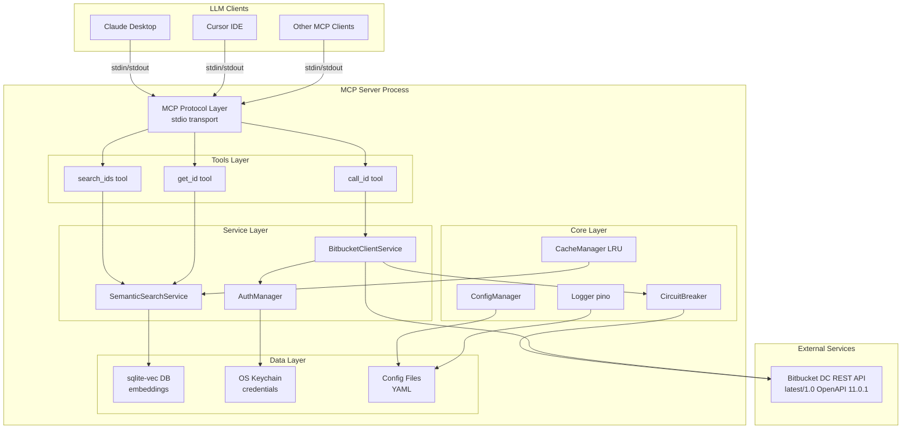

# High Level Architecture

> **Plain Language Summary:**  
> This section describes the "big picture" architecture - how the different parts of the system work together. Think of it like a blueprint for a building, showing where each room is and how they connect. We'll cover:
> - **What the system does** (Technical Summary)
> - **Where it runs** (Platform Choice)
> - **How files are organized** (Repository Structure)
> - **Visual diagrams** showing component relationships
> - **Design patterns** we follow (like building codes for software)

### Technical Summary

O Bitbucket DataCenter MCP Server é um **monolito em camadas stateless** construído com Node.js/TypeScript que expõe 3 ferramentas MCP via stdio transport para LLMs. A arquitetura implementa busca semântica inteligente usando sqlite-vec para embeddings vetoriais (768 dimensões via Xenova/all-mpnet-base-v2), permitindo queries em linguagem natural com >90% de relevância. O backend integra-se com Bitbucket Data Center REST API através de um client HTTP robusto com rate limiting (100 req/s), retries exponenciais, e circuit breaker pattern. A solução é self-hosted, deployável via Docker (multi-arch: amd64/arm64) ou npm global, com autenticação multi-estratégia (OAuth 2.0 PKCE, PAT, OAuth 1.0a, Basic) e credentials storage seguro via OS keychain. Performance targets: p95 <500ms para search, <2s para call_id, <512MB RAM baseline, startup <5s.

### Platform and Infrastructure Choice

**Platform:** Self-Hosted On-Premise (Data Center focus)

**Key Services:**
- **Runtime:** Node.js 22+ LTS (Alpine Linux para Docker)
- **Vector Database:** sqlite-vec (embedded, zero-config)
- **Credential Storage:** OS Keychain (macOS Keychain, Windows Credential Manager, Linux Secret Service)
- **Embeddings:** @xenova/transformers (local model: Xenova/all-mpnet-base-v2, 768 dimensions)
- **CI/CD:** GitHub Actions (Linux, macOS, Windows runners)
- **Registry:** npm (global package), Docker Hub (multi-arch images)

**Deployment Host and Regions:**
- Self-hosted: Customer infrastructure (on-premise, private cloud, bare metal)
- Deployment modes: Docker containers, npm global install, Kubernetes pods
- Regions: Customer-controlled (suporta air-gapped deployments)

**Rationale:** 
Enterprise organizations usando Bitbucket Data Center têm requisitos de compliance (GDPR, HIPAA, SOC2) que exigem self-hosted solutions. Cloud-first seria deal-breaker para 70%+ do mercado-alvo. Self-hosted também elimina custos de infraestrutura recorrentes, permitindo modelo de pricing mais competitivo ($0-10K/ano vs $50K+ managed).

### Repository Structure

**Structure:** Monorepo (single package)

**Monorepo Tool:** npm workspaces (futuro: considerar se expandir para múltiplos packages)

**Package Organization:**
```
bitbucket-dc-mcp-server/              # Root monorepo
├── src/                         # Source code
│   ├── tools/                   # MCP tools (search_ids, get_id, call_id)
│   ├── services/                # Business logic (SemanticSearch, BitbucketClient, Auth)
│   ├── core/                    # Core utilities (Config, Logger, Cache, CircuitBreaker)
│   ├── validation/              # Schema validation (Zod schemas)
│   ├── auth/                    # Authentication strategies
│   └── index.ts                 # Entry point MCP server
├── scripts/                     # Build-time scripts
│   ├── download-openapi.ts      # Download Bitbucket OpenAPI spec
│   ├── generate-schemas.ts      # Generate Zod schemas
│   ├── generate-embeddings.ts   # Generate embeddings via Transformers.js
│   └── populate-db.ts           # Populate sqlite-vec database
├── data/                        # Generated data (not committed)
│   ├── embeddings.db            # sqlite-vec database
│   ├── operations.json          # Parsed operations (intermediate)
│   └── schemas.json             # Extracted schemas (intermediate)
├── tests/                       # Test suites
│   ├── unit/                    # Unit tests (Jest/Vitest)
│   ├── integration/             # Integration tests
│   └── e2e/                     # End-to-end MCP tests
├── docs/                        # Documentation
│   ├── prd.md
│   ├── architecture.md
│   ├── authentication.md
│   ├── api-reference.md
│   └── cookbook.md
└── .github/                     # CI/CD workflows
    └── workflows/
```

**Rationale:**
- Monorepo simplifica para MVP scope (single product, atomic commits)
- npm workspaces nativo (zero dependencies) suficiente até ter múltiplos packages
- Estrutura permite future extraction (ex: MCP SDK wrapper, CLI utilities)

### High Level Architecture Diagram



### Architectural Patterns

- **Layered Monolith:** Separação clara de responsabilidades (MCP Protocol → Tools → Services → Core → Data). Cada camada depende apenas da inferior, facilitando testing e future refactoring. Rationale: Simplicidade para MVP, performance (no inter-service calls), facilita debugging.

- **Strategy Pattern (Authentication):** Interface `AuthStrategy` com implementações concrete (OAuth2, PAT, OAuth1, Basic). Permite adicionar novos métodos sem modificar core. Rationale: Bitbucket DC suporta 4 auth methods, precisa flexibilidade.

- **Repository Pattern (Data Access):** Abstração para sqlite-vec queries via `EmbeddingsRepository`. Rationale: Isola vector search logic, facilita testes com mock DB, permite future migration para Pinecone/Weaviate.

- **Circuit Breaker Pattern:** Wraps `BitbucketClientService.executeOperation()` para fail-fast quando Bitbucket está down. Estados: CLOSED → OPEN → HALF_OPEN. Rationale: Protege contra cascading failures, reduz latency em downtime scenarios.

- **Retry with Exponential Backoff:** Decorator em HTTP client para retries automáticos (3x: 100ms, 500ms, 2s) em erros transientes (timeout, 429, 5xx). Rationale: Melhora reliability sem overhead manual.

- **Dependency Injection (Simple):** Classes recebem dependencies via constructor (não usa framework pesado). Rationale: Testability (easy mocking), explicitness sobre dependencies.

- **Factory Pattern (Auth):** `AuthStrategyFactory` cria strategy baseado em config. Rationale: Centraliza lógica de seleção, simplifica client code.

- **Singleton (Managed):** `Logger`, `ConfigManager`, `CacheManager` são singletons gerenciados (criados uma vez no startup). Rationale: Recursos compartilhados, evita múltiplas instâncias.

